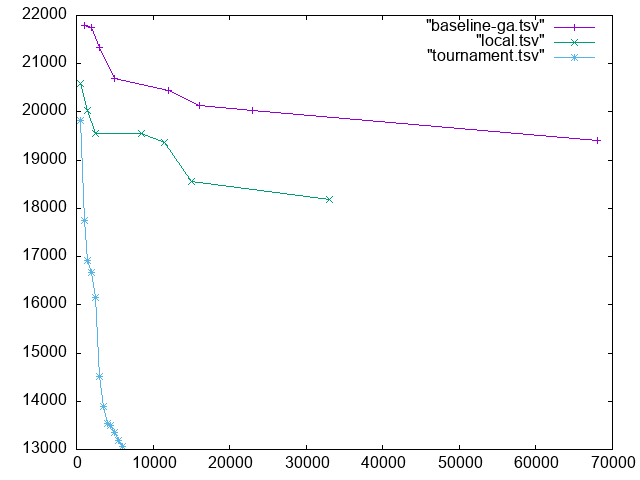
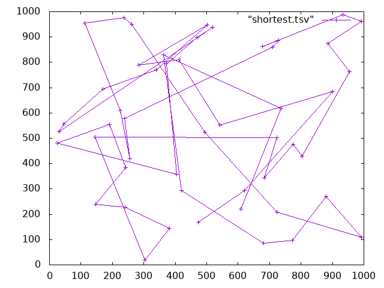
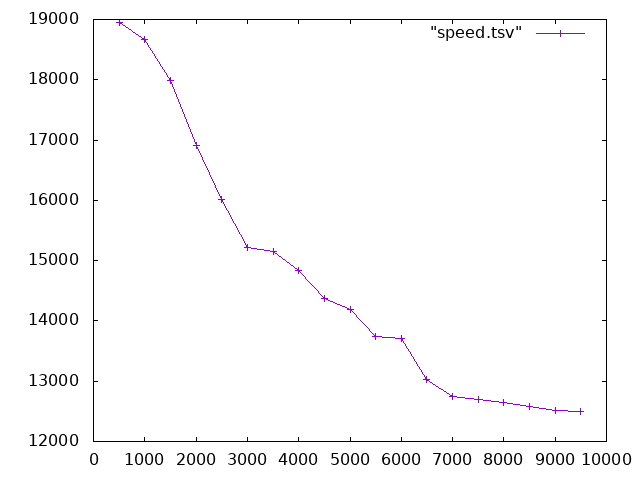
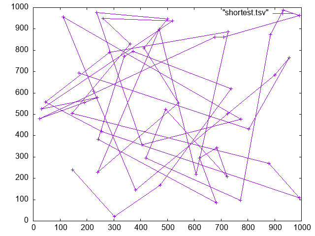
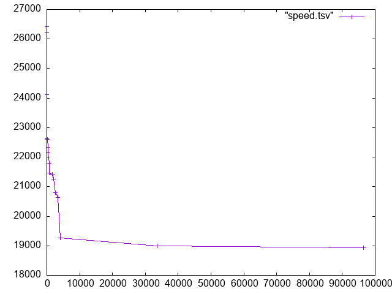

# HW 11: Traveling Salesperson Problem Part 3

**By: Aadit Bagdi, Cole Nemec, Julian Prince, and Taylor Blair**

# How to make

To make, run `make tsp`

# Results! 
## Comparison:

 

With the update we were able to achieve a path of 12,492.6 in 9,500 iterations.

For context, here is the previous best route and time it took
 
*The* `shortest.tsv` *in the upper right is a formatting mistake.*

It took 100,000 iterations to find that route.

